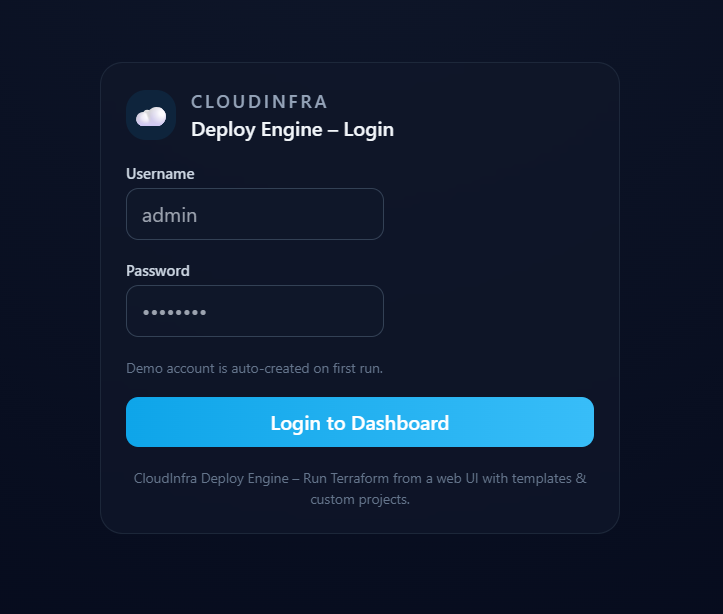
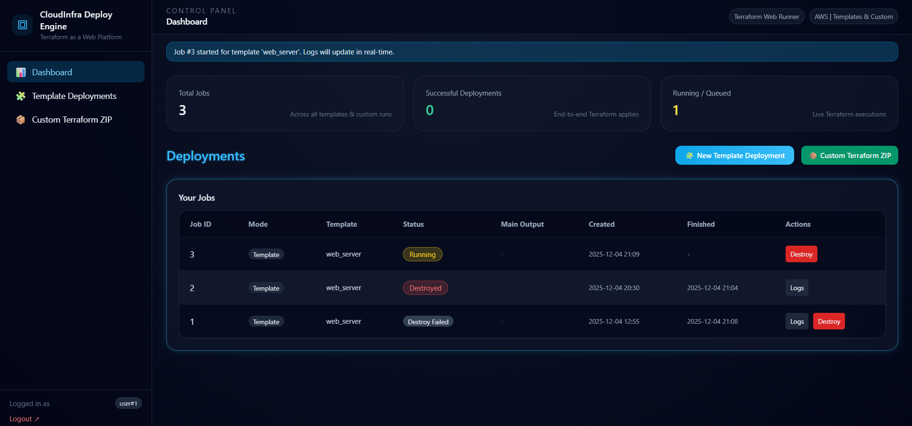
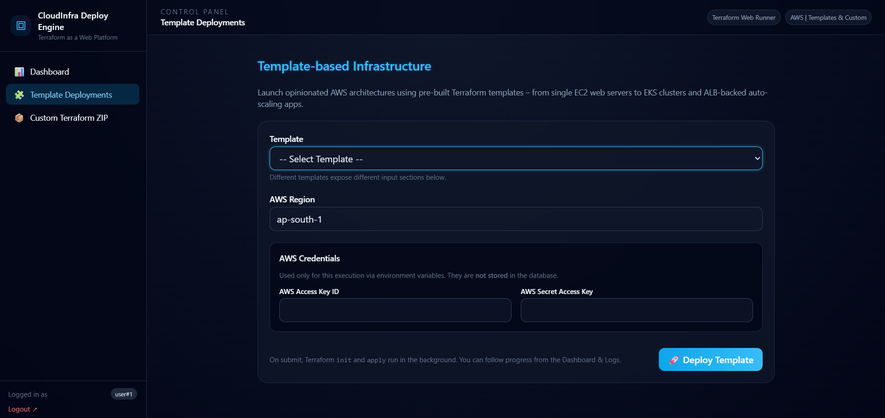
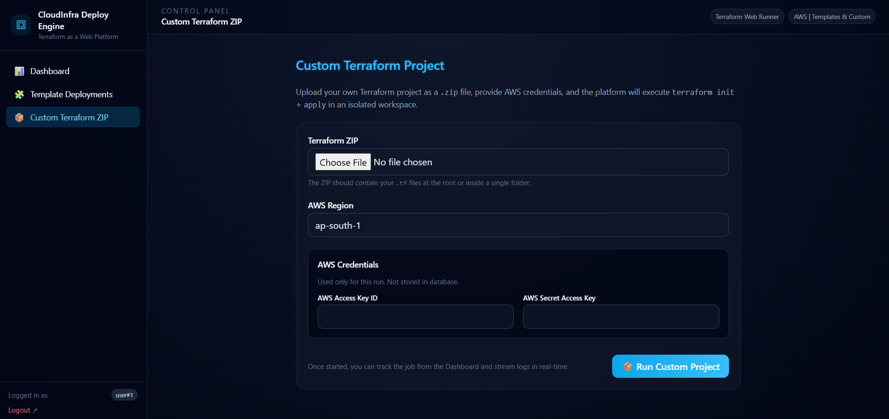
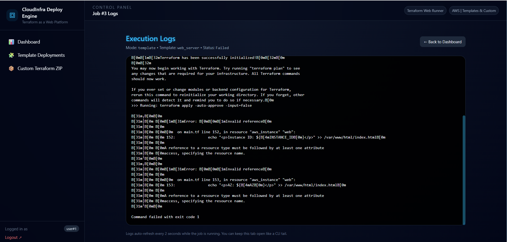

<p align="center">
 <br> <b>CloudInfra Deploy Engine v2</b> <br> <i>A Web-Based Terraform Deployment Platform for AWS</i> </p> <p align="center">     </p>

# ☁️ CloudInfra Deploy Engine v2  
### A Web-Based Terraform Deployment Platform for AWS

CloudInfra Deploy Engine is a **full-stack Terraform automation platform** that lets you deploy AWS infrastructure from a **web UI** instead of the CLI.

It is designed for:

- Students learning **Cloud + DevOps**
- DevOps beginners who are scared of long CLI commands 😅
- Small teams who want **repeatable infrastructure** with a simple dashboard

With this platform, you can:

- Deploy **pre-built AWS infrastructure templates** from a web form  
- Upload a **custom Terraform project (ZIP)** and run it from the browser  
- Watch **live Terraform logs** in a UI  
- View **Terraform outputs** (IP, DNS, endpoints, IDs, etc.)  
- Trigger **terraform destroy** safely from the dashboard  

---

## 🔥 Core Features

### 🔐 1. Secure Login & Dashboard

- Simple Flask-based login with session handling
- Authenticated dashboard per user
- Each user sees **only their own jobs**
- At a glance, you can see:
  - Job ID
  - Mode (Template / Custom)
  - Template Name (if any)
  - Status (Queued / Running / Success / Failed / Destroyed)
  - Primary Output (IP / DNS / Endpoint / VPC ID etc.)
  - Created & Finished timestamps
  - Quick actions for **Logs / Outputs / Destroy**

---

### 🧩 2. Template Mode – One-Click Standard Infrastructures

Choose from pre-built, battle-tested Terraform templates and fill a simple form.

Currently supported templates:

1. 🟢 **Web Server – Single EC2 Instance (`web_server`)**
   - Launches one EC2 instance
   - Installs a web server (Apache)
   - Returns public IP + DNS

2. 🌐 **VPC – Public/Private Subnets (`vpc_basic`)**
   - Creates a basic VPC
   - Public + private subnets across AZs
   - Good starting point for multi-tier architectures

3. 🧊 **Static Website – S3 + CloudFront (`s3_cloudfront`)**
   - S3 bucket for static hosting
   - CloudFront distribution in front
   - Ideal for portfolio / landing pages

4. 🏗️ **Two-Tier App – EC2 + RDS (`two_tier_app`)**
   - Web layer: EC2 instance
   - DB layer: MySQL RDS instance
   - Outputs include web DNS/IP & DB endpoint

5. ☸️ **EKS Cluster – Basic Managed Node Group (`eks_basic`)**
   - Creates a minimal EKS cluster
   - Managed node group using default VPC subnets
   - Good for learning Kubernetes on AWS  
   > Note: EKS creation can take several minutes.

6. ⚖️ **ALB + ASG – Highly Available Web App (`alb_asg`)**
   - Application Load Balancer (public)
   - Auto Scaling Group of EC2 instances behind ALB
   - User data installs and serves a simple web page
   - Shows instance ID & AZ to visualize load balancing

7. 🔒 **Secure Web Hosting – GitHub-powered Nginx (`secure_web_hosting`)**
   - Hardened EC2 server with:
     - SSH restricted by CIDR
     - Password authentication disabled (key-only)
   - Installs **Nginx + Git**
   - Clones your app from **GitHub**  
   - Serves from a configurable subdirectory (e.g. `dist`, `build`)
   - Uses `server_name` = given **domain name** in nginx config

Each template has its **own parameter section** that auto-appears when selected in the dropdown.

---

### 📦 3. Custom Mode – Any Terraform Project via ZIP

For advanced users:

- Upload **any Terraform project** as a `.zip`
- Platform:
  - Extracts it into a unique job directory
  - Runs `terraform init` + `terraform apply` under the hood
  - Streams logs to UI
  - Captures outputs (if defined in the project)

This essentially converts your browser into a **generic Terraform runner**.

---

### 📡 4. Live Log Streaming

- Each job has a **Logs** page
- Looks like a “terminal window” in the browser
- Auto-refreshes every 2 seconds while the job is running
- Perfect for:
  - Debugging Terraform errors
  - Seeing provider downloads, resource creation, etc.

---

### 📤 5. Outputs Viewer

- After a successful run, all Terraform `outputs` are stored
- Dedicated **Outputs** page:
  - Shows name, type, and value
  - Values are rendered using `tojson(indent=2)` for readability
- Helpful for quickly grabbing:
  - EC2 public IP / DNS
  - ALB DNS name
  - EKS endpoint
  - RDS endpoint
  - VPC ID, etc.

---

### 🧨 6. Destroy Infrastructure from UI

From the Dashboard:

- Click **Destroy** on any completed job
- A confirmation modal appears
- You provide:
  - AWS Access Key
  - AWS Secret Key
  - Region
- The system runs `terraform destroy` for that job’s workspace

This closes the Infrastructure lifecycle loop: **Create → Observe Logs → View Outputs → Destroy**.

---

## 🧱 Architecture Overview

High-level architecture:

```text
+-----------------------------+
|       Web Frontend          |
| (Flask Jinja2 Templates)    |
|  - Login                    |
|  - Dashboard                |
|  - Template Forms           |
|  - Custom ZIP Upload        |
|  - Logs & Outputs           |
+--------------+--------------+
               |
               | HTTP
               v
+-----------------------------+
|         Flask Backend       |
|  - Authentication           |
|  - Job Model (SQLite)       |
|  - Handle Template Params   |
|  - File Uploads             |
|  - Spawn Terraform Runner   |
+--------------+--------------+
               |
               | Subprocess + Env Vars
               v
+-----------------------------+
|     Terraform Runner        |
|  - Per-job workspace        |
|  - `terraform init/apply`   |
|  - `terraform destroy`      |
|  - Capture logs + outputs   |
+--------------+--------------+
               |
               | AWS Provider
               v
+-----------------------------+
|        AWS Cloud            |
| EC2 | VPC | ALB | ASG | EKS |
|   RDS | S3 | CloudFront     |
+-----------------------------+
````

---

## 🗂 Project Structure

```text
cloudinfra-deploy-engine-v2/
│
├── backend/
│   ├── app.py                  # Main Flask app, routes, job handling
│   ├── models/                 # User & Job models (e.g. SQLite)
│   ├── utils/
│   │   └── terraform_runner.py # Abstraction for Terraform subprocess execution
│   ├── templates/              # Jinja2 HTML templates (premium UI)
│   │   ├── base.html
│   │   ├── login.html
│   │   ├── dashboard.html
│   │   ├── deploy_template.html
│   │   ├── custom.html
│   │   ├── logs.html
│   │   └── outputs.html
│   └── static/
│       └── css/
│           └── main.css        # Custom styling layer on top of Tailwind
│
├── infra/
│   └── templates/
│       └── aws/                # All Terraform modules
│           ├── web_server/
│           ├── vpc_basic/
│           ├── s3_cloudfront/
│           ├── two_tier_app/
│           ├── eks_basic/
│           ├── alb_asg/
│           └── secure_web_hosting/
│
├── requirements.txt            # Python dependencies
├── .gitignore                  # Ignore Terraform cache, venv, logs, etc.
├── LICENSE                     # MIT License
└── README.md                   # This file
```

---

## 🛠️ Tech Stack

* **Backend:** Python, Flask
* **Frontend:** HTML, Jinja2, TailwindCSS + custom CSS
* **Infrastructure as Code:** Terraform
* **Cloud Provider:** AWS
* **Database:** SQLite (local dev)
* **Version Control:** Git + GitHub

---

## 💻 Running the Project Locally

### 1. Prerequisites

* Python 3.10+
* Terraform installed and available in `PATH`
* AWS IAM user with:

  * Programmatic Access
  * Permissions for the services you plan to create (EC2, VPC, ALB, ASG, RDS, EKS, S3, CloudFront, etc.)

> ⚠️ Recommended: Use **separate IAM user** only for testing this tool, with limited permissions and budget alerts enabled.

---

### 2. Clone the Repository

```bash
git clone https://github.com/balwant2711/cloudinfra-deploy-engine-v2.git
cd cloudinfra-deploy-engine-v2
```

---

### 3. Create and Activate Virtualenv (Optional but Recommended)

```bash
python -m venv venv
# Windows
venv\Scripts\activate
# Linux/macOS
source venv/bin/activate
```

---

### 4. Install Python Dependencies

```bash
pip install -r requirements.txt
```

---

### 5. Initialize Database (if script/logic exists)

If `app.py` includes a DB initialization route or function, run that once (for example):

```bash
cd backend
python app.py
```

The app often auto-creates the SQLite DB & default admin user on first run.

---

### 6. Run the Flask App

From the `backend` folder:

```bash
python app.py
```

By default, it should run on:

```text
http://127.0.0.1:5000
```

Open that in your browser.

---

## 🧭 Usage Walkthrough

### 1. Login

* Open the app in your browser
* Use the demo credentials created by the app (or as per your config)
* After login, you’ll land on the **Dashboard**

---

### 2. Deploy via Template Mode

1. Go to **Template Deployments**
2. Select a template from the dropdown
3. Fill template-specific parameters:

   * Example:

     * Web Server: instance name + key pair
     * Two-Tier App: instance + key pair + DB name/user/password
     * Secure Web Hosting: GitHub URL, branch, domain, SSH CIDR, instance type
4. Provide AWS Access Key & Secret Key at the bottom
5. Click **Deploy Template** 🚀
6. You’ll be redirected to Dashboard where a new Job appears
7. Use **Logs** to watch Terraform in action
8. On success, open **Outputs** to see endpoints, IDs, etc.

---

### 3. Deploy Custom Terraform ZIP

1. Go to **Custom Terraform ZIP**
2. Upload a `.zip` containing your `.tf` files
3. Provide region + AWS credentials
4. Submit to create a new job
5. Track via Dashboard + Logs + Outputs as usual

---

### 4. Destroy a Deployment

1. On Dashboard, locate the desired job
2. Click **Destroy**
3. Enter AWS credentials and confirm
4. Terraform destroy is executed in the background
5. Status changes to `Destroyed` / `Destroy Failed` accordingly

---

## 🔐 Security Considerations

* AWS credentials are collected via form **per run**
* Intended usage: Pass credentials to Terraform via **environment variables**
* Keys are **not meant to be stored in the database**
* Logs are designed to **avoid printing sensitive values**
* SSH can be restricted via CIDR for Secure Web Hosting
* EKS, ALB+ASG and other heavy templates should be **destroyed after testing** to avoid unwanted AWS charges

> For production-grade SaaS, future improvements could include:
>
> * AWS IAM Role-based access (AssumeRole)
> * Encrypted secrets storage (e.g. AWS Secrets Manager)
> * Multi-user RBAC & per-tenant isolation

---

## 🚀 Future Enhancements

* Multi-cloud support (AWS + GCP + Azure)
* CI/CD integration (GitHub webhooks to auto-trigger deployments)
* Cost estimation (e.g., integrate [Infracost](https://www.infracost.io/))
* Visual infrastructure graphs from Terraform plans
* Role-Based Access Control (RBAC) & team accounts
* Job filters, search, and analytics (e.g., per-template usage chart)

---

## 📸 Screenshots 

## 📸 UI Previews

### 📤 Login Page


### 🏠 Dashboard


### 📋 Template Deployment


### 🗂️ Custom ZIP Deployment


### 🖥️ Live Logs



---

## 🧑‍💻 Author

**Balwant Singh (@balwant2711)**

* Cloud & DevOps enthusiast
* Focus areas: AWS, Terraform, Python, CI/CD, Infrastructure Automation

Feel free to open issues or suggestions if you want to extend or adapt this project.

---

## 📜 License

This project is licensed under the **MIT License**.
See the [LICENSE](LICENSE) file for details.


::contentReference[oaicite:0]{index=0}
```


